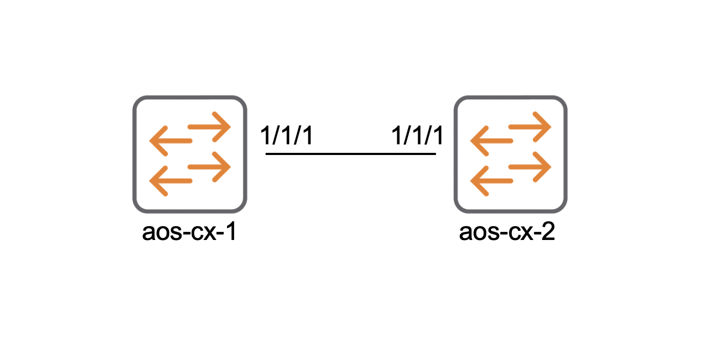

# Aruba API Yourself

The aim of this HackShack Jupyter notebook is to explain the basics of interacting with the Aruba AOS-CX REST API using Python.

# Prerequisites

## Lab Setup

The notebook interacts with a test network made up of two interconnected AOS-CX devices. These can be virtual AOS-CX OVAs, but hardware is preferable. See the 'Lab Diagram' below and please note that the devices must be connected together using ports 1/1/1 in order for the default code to run successfully.

### Lab Diagram

### A word about defaults

The code uses default variables for the following:  

* IP addresses: 2001\:db8\:2::101 & 2001\:db8\:2:102
* Username: admin
* Password: admin123
* Firmware: FL.10.04.3000

These variables can be altered to match the user's particular setup.

## Jupyter requirements

The notebook uses Python and requires the Python third-party library 'Requests'.  
Install 'Requests' by running `pip install requests` in a terminal.

## Other dependencies

None

[View the notebook now](./HackShack-Aruba-Lab-1.ipynb)
